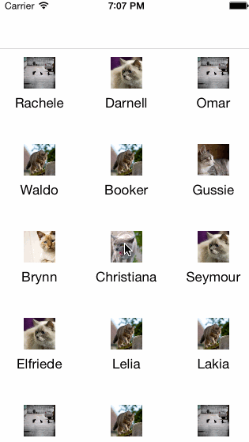

 &nbsp;
 &nbsp;


ZoomInteractiveTransition
=======================

Simple zoom transition, inspired by iOS 7 Photos.app. Example:



## Usage

**1.** Create ZoomInteractiveTransition instance and pass your UINavigationController to constructor.

```objective-c
self.transition = [[ZoomInteractiveTransition alloc] initWithNavigationController:self.navigationController];
```

**2.** Adopt ZoomTransitionProtocol by both source and destination view controllers and implement a single method

```objective-c
-(UIView *)viewForZoomTransition:(BOOL)isSource
{
  return <view for zooming>;
}
```

And that's it! All frame calculation and animations are performed automatically. ZoomInteractiveTransition creates a snapshot of source and destination view, chooses bigger one, and uses this snapshot to animate between source and destination view.

## Requirements

* iOS 7
* ARC

## Customization

Available customizations:

* Duration
* Animation curve
* Interactive pop back gesture
* Initial snapshot
* Completion block

Additionally, you can plug in your own keyframe animations, that will run alongside interactive transition. These can be supplied via optional <ZoomTransitionProtocol> method animationBlockForZoomTransition.

## Example

Example with cats is provided in ZoomTransitionExample folder.

*Note:* PlaceKit.framework, that is used in Example project, requires ssh key to clone it's repository, so you may need to add Github SSH key on your local machine to be able to install example project. [Instructions](https://help.github.com/articles/generating-ssh-keys/).
